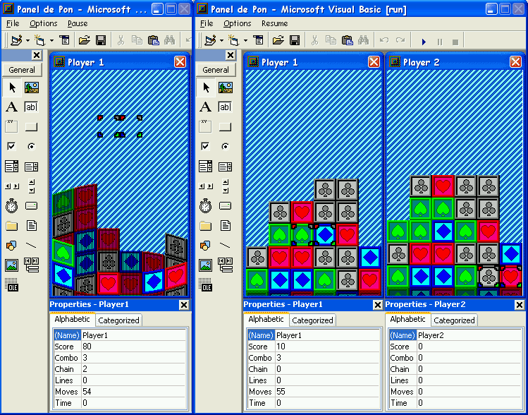



## Panel de Pon

### Description

A remake of Panel de Pon/Tetris Attack/Pokemon Puzzle. Now with online play, chains now register correctly, and basic/pathetic AI. But you can turn the AI's speed to compensate for it's current lack of ability. Fixed garbage block behaviour, added the 3D/Cylinder mode from the N64/Cube versions
 
### More Info
 

             |
---                |---
**Submitted On**   |2004-09-06 23:18:02
**By**             |[Techni Rei Myoko](https://github.com/Planet-Source-Code/PSCIndex/blob/master/ByAuthor/techni-rei-myoko.md)
**Level**          |Advanced
**User Rating**    |5.0 (20 globes from 4 users)
**Compatibility**  |VB 6\.0
**Category**       |[Games](https://github.com/Planet-Source-Code/PSCIndex/blob/master/ByCategory/games__1-38.md)
**World**          |[Visual Basic](https://github.com/Planet-Source-Code/PSCIndex/blob/master/ByWorld/visual-basic.md)
**Archive File**   |[Panel\_de\_P179029972004\.zip](https://github.com/Planet-Source-Code/techni-rei-myoko-panel-de-pon__1-54936/archive/master.zip)

